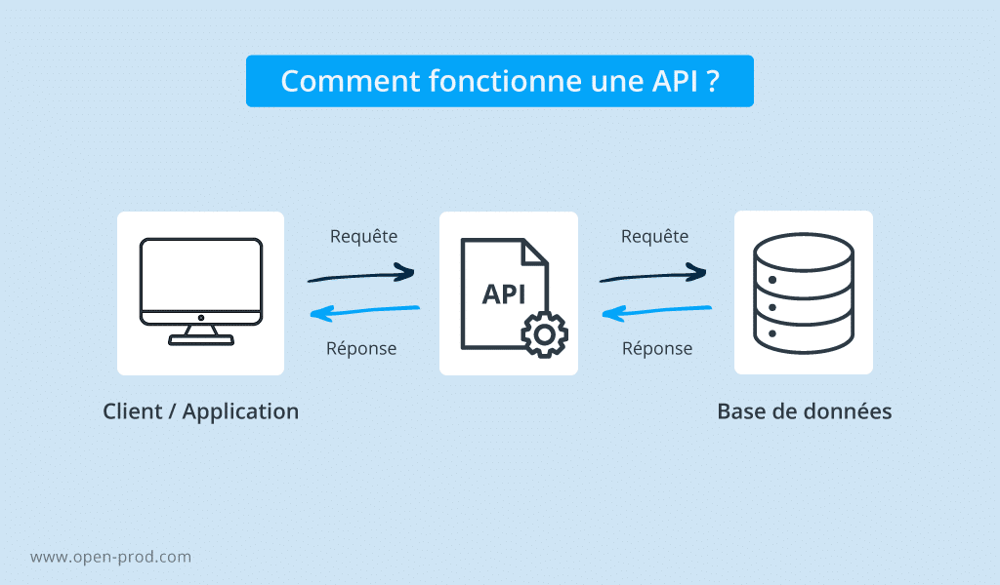

# Chapitre 2 : Utiliser une API pour extraire des données

## Objectifs

Voici les objectifs de ce module :
- [x] Comprendre le principe d'une API
- [x] Savoir utiliser une API
- [x] Extraire des données d'API
- [x] Rappels algorithmiques

## C'est quoi une API ?



1. Défintion d'une API selon [api.gouv.fr](https://api.gouv.fr/guides/api-definition)
2. Les differentes [methodes](https://blog.postman.com/what-are-http-methods/) d'appel API.

| **Nom Méthode** | Description |
|------------------|-------------|
| **GET** | Récupérer des données d'un serveur | 
| **POST** |Envoyer des données au serveur pour créer une ressource ou déclencher une action | 
| **PUT** | Mettre à jour ou remplacer une ressource existante sur le serveur | 
| **DELETE** | Supprimer une ressource sur le serveur | 

3. Les différentes réponses de l'API
   
| **Code** | **Signification**                     | **Description**                                |
|----------|---------------------------------------|------------------------------------------------|
| **200**  | OK                                    | Requête réussie.                               |
| **201**  | Created                               | Nouvelle ressource créée avec succès.          |
| **204**  | No Content                            | Aucune donnée à retourner (succès sans contenu).|
| **400**  | Bad Request                           | Requête mal formée.                            |
| **401**  | Unauthorized                          | Authentification requise ou échouée.           |
| **403**  | Forbidden                             | Accès refusé à la ressource.                   |
| **404**  | Not Found                             | Ressource non trouvée.                         |
| **500**  | Internal Server Error                 | Erreur serveur générique.                      |
| **503**  | Service Unavailable                   | Serveur indisponible temporairement.           |


## Utiliser l'API de l'ADEME sur leur site internet

1. Aller sur l'[API des logements existants de l'ADEME](https://data.ademe.fr/datasets/dpe-v2-logements-existants/api-doc)
2. Dans données, cliquer sur la méthode `GET /lines`
3. Effectuer une première requête `GET` en récupérant les données de la première page. Observer la réponse de la requête.
4. Effectuer une requête `GET` en récupérant les données de la page 1 avec 5 résultats
5. Effectuer une requête `GET` en récupérant les données de la page 1 avec 5 résultats et en sélectionnant les colonnes `N°DPE`,  `Etiquette_DPE` et `Date_réception_DPE`
6. Effectuer une requête `GET` en récupérant les données de la page 1 avec 5 résultats et en sélectionnant  les colonnes `N°DPE`,  `Etiquette_DPE` et `Date_réception_DPE` et en filtrant par  `Etiquette_DPE` égale à E
7. Effectuer une requête `GET` en récupérant les données de la page 1 avec 20 résultats et en sélectionnant  les colonnes `N°DPE`,  `Etiquette_DPE` et `Date_réception_DPE` et en filtrant par  `Etiquette_DPE` égale à E, F ou G.
8. Effectuer une requête `GET` en récupérant les données de la page 1 avec 5 résultats et en sélectionnant  les colonnes `N°DPE`,  `Etiquette_DPE` et `Date_réception_DPE` et en filtrant par  `Date_réception_DPE` entre le *2024-01-01* au *2024-01-31*
9. Effectuer une requête `GET` en récupérant les données de la page 1 avec 5 résultats et en sélectionnant  les colonnes `N°DPE`,  `Etiquette_DPE` et `Date_réception_DPE` et en filtrant par  `Date_réception_DPE` après le *2024-07-31*
10. Effectuer une requête `GET` en récupérant les données de la page 1 avec 5 résultats et en sélectionnant  les colonnes `N°DPE`,  `Etiquette_DPE`, `Date_réception_DPE` et `Code_postal_(BAN)` en filtrant par le `Code_postal_(BAN)` *69360*. Combien y a t-il de logements concernés dans la base de données ?

:warning: Pour une raison inexpliquée, il est recommandé d'utiliser le paramètre `q` et `q_fields` de l'API pour ce filtre.

11. Pour ce même code postal, effectuer une requête `GET` en récupérant les données de la page 2 avec 3000 résultats par page et en sélectionnant  les colonnes `N°DPE`,  `Etiquette_DPE`, `Date_réception_DPE` et `Code_postal_(BAN)`. Comment expliquer que le résultat retourne zéro ligne ? 


## Utiliser l'API de l'ADEME avec R

1. Installer et charger les librairies
```r
install.packages(c("httr", "jsonlite"))
```

2. Effectuer les mêmes questions que l'exercice précédent à l'aide du langage R. Voici un exemple avec les paramètres que vous avez déjà utilisés : 

```r
library(httr)
library(jsonlite)

base_url <- "https://data.ademe.fr/data-fair/api/v1/datasets/dpe-v2-logements-existants/lines"
# Paramètres de la requête
params <- list(
  page = 1,
  size = 5,
  select = "N°DPE,Code_postal_(BAN),Etiquette_DPE,Date_réception_DPE",
  q = "69008",
  q_fields = "Code_postal_(BAN)",
  qs = "Date_réception_DPE:[2023-06-29 TO 2023-08-30]"
) 

# Encodage des paramètres
url_encoded <- modify_url(base_url, query = params)
print(url_encoded)

# Effectuer la requête
response <- GET(url_encoded)

# Afficher le statut de la réponse
print(status_code(response))

# On convertit le contenu brut (octets) en une chaîne de caractères (texte). Cela permet de transformer les données reçues de l'API, qui sont généralement au format JSON, en une chaîne lisible par R
content = fromJSON(rawToChar(response$content), flatten = FALSE)

# Afficher le nombre total de ligne dans la base de données
print(content$total)

# Afficher les données récupérées
df <- content$result
dim(df)
View(df)
```

## Extraction des données complètes pour le Rhône

:warning: Pour protéger l'infrastructure de publication de données, l'ADEME a limité les appels par des règles  :

-  Un utilisateur anonyme ne peut pas effectuer plus de 600 requêtes par interval de 60 secondes. Sa vitesse de téléchargement totale sera limitée à 2 MB/s pour les contenus statiques (fichiers de données, pièces jointes, etc.) et à 500 kB/s pour les autres appels.
-  La valeur `page` * `size` ne peut pas dépasser 10 000

:bulb: Pour contourner ces limitations, nous allons récupérer uniquement les données d'un département. L'astuce étant d'appeler l'API en parcourant chaque commune.

1. Récupérer tous les codes postaux du département du Rhône(69) à l'aide du fichier `adresses-69.csv`
2. Avec une boucle, parcourir chaque code postal afin de reconstruire le dataframe complet des logements existants sur le département. Exporter le résultat dans un fichier appelé `existants_69.csv`

:warning: S'il y a plus de 10000 logements pour un code postaux, il est conseillé d'ajouter un filtre supplémentaire pour parcourir les `Date_réception_DPE` de chaque année depuis 2021.

3. Même question pour les logements neufs. Exporter le résultat dans un fichier appelé `neufs_69.csv`
4. Fusionner les deux dataframes avec uniquement les colonnes communes.
5. Exporter le résultat en dans un fichie appelé `logements_69.csv`


## Liens utiles

Voici quelques liens utiles :

- [Défintion d'une API selon api.gouv.fr](https://api.gouv.fr/guides/api-definition)
- [HTTP methodes](https://blog.postman.com/what-are-http-methods/)
- [API avec R](https://statisticsglobe.com/api-in-r#what-is-an-api)
- [API des logements neufs](https://data.ademe.fr/datasets/dpe-v2-logements-neufs/api-doc)
- [API des logements existants](https://data.ademe.fr/datasets/dpe-v2-logements-existants/api-doc)
- [API - GET query with range parameters from ElasticSearch](https://www.elastic.co/guide/en/elasticsearch/reference/current/query-dsl-query-string-query.html#_ranges)