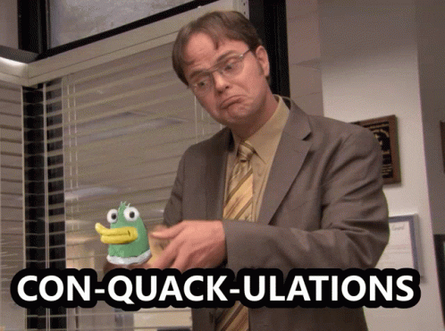

# Chapitre 4 : Initiation au R Markdown

- [Chapitre 4 : Initiation au R Markdown](#chapitre-4--initiation-au-r-markdown)
  - [Objectifs](#objectifs)
  - [Pourquoi utiliser R Markdown ?](#pourquoi-utiliser-r-markdown-)
  - [Créer un fichier R Markdown dans RStudio](#créer-un-fichier-r-markdown-dans-rstudio)
    - [Étapes simples](#étapes-simples)
    - [Structure du document](#structure-du-document)
  - [Ne pas confondre un script R et un fichier R Markdown](#ne-pas-confondre-un-script-r-et-un-fichier-r-markdown)
    - [Le script R `.R`](#le-script-r-r)
    - [Le script R Markdown `.Rmd`](#le-script-r-markdown-rmd)
  - [Librairies à installer](#librairies-à-installer)
  - [Conseils pratiques avant de se lancer](#conseils-pratiques-avant-de-se-lancer)
  - [Tableau récapitulatif des commandes Markdown utiles](#tableau-récapitulatif-des-commandes-markdown-utiles)
  - [Les chunks](#les-chunks)
    - [Options les plus utiles](#options-les-plus-utiles)
    - [Définir les options par défaut des chunks](#définir-les-options-par-défaut-des-chunks)
    - [Nommer les chunks de code](#nommer-les-chunks-de-code)
  - [Créer des tableaux élégants](#créer-des-tableaux-élégants)
    - [Avec le package `knitr`](#avec-le-package-knitr)
    - [Avec le package `gt`](#avec-le-package-gt)
  - [Intérêt des paramètres dans l’en-tête YAML](#intérêt-des-paramètres-dans-len-tête-yaml)
    - [À quoi servent les paramètres ?](#à-quoi-servent-les-paramètres-)
    - [Exemple d’en-tête YAML avec paramètres](#exemple-den-tête-yaml-avec-paramètres)
    - [Utiliser dans le texte ou le code](#utiliser-dans-le-texte-ou-le-code)
    - [Intérêt pratique](#intérêt-pratique)
  - [Aller plus loin](#aller-plus-loin)
  - [Liens utiles](#liens-utiles)


## Objectifs

Voici les objectifs de ce module :
- [x] Créer et structurer un document R Markdown
- [x] Utiliser des chunks de code avec options et noms
- [x] Intégrer texte, tableaux et graphiques
- [x] Exploiter des paramètres et variables pour produire des rapports dynamiques


## Pourquoi utiliser R Markdown ?

R Markdown est un **outil puissant** permettant de combiner dans un même document :
- Du **texte** (rédigé en Markdown),
- Du **code R** exécutable,
- Et les **résultats** (graphiques, tableaux, statistiques…).

L'objectif est de créer des rapports **reproductibles**, **dynamiques** et **personnalisables**, exportables en plusieurs formats :
- `.html` (pages web interactives),
- `.pdf` (rapport imprimable),
- `.docx` (document Word),
- voire des **présentations** (`.pptx`, `ioslides`, `slidy`, etc.).

Les avantages principaux sont :
- Automatisation des rapports (gain de temps énorme)
- Intégration directe de résultats R sans copier-coller
- Traçabilité et transparence des analyses
- Compatible avec Git / GitHub pour la collaboration

## Créer un fichier R Markdown dans RStudio

### Étapes simples
1. Ouvrir **RStudio**  
2. Aller dans **File → New File → R Markdown...**
3. Donner un **titre** et un **auteur**
4. Choisir un **format de sortie** (HTML, Word ou PDF)
5. Cliquer sur **OK** → un fichier `MonDocument.Rmd` est créé avec une structure de base

### Structure du document
- Un **en-tête YAML** : contient les métadonnées (titre, auteur, date, type de sortie)
- Du **texte Markdown**
- Des **chunks R** : zones de code exécutables

```yaml
---
title: "Mon Cours RMarkdown"
author: "Nom de l'auteur"
output: word_document
---
```


## Ne pas confondre un script R et un fichier R Markdown

Il est très important de bien distinguer **un script R classique** (`.R`) d’un **document R Markdown** (`.Rmd`), car ils n’ont **pas le même objectif** ni la même structure.

### Le script R `.R`

Un **script R** est un **fichier de code pur**.  
Il contient uniquement du code R, ligne après ligne, exécuté directement dans la console.

- Pour tester du code, faire des analyses exploratoires, créer des fonctions ou des scripts automatisés.  
- Les résultats apparaissent dans la **console** ou dans les **fenêtres graphiques** de RStudio.  
- Aucune mise en forme textuelle ni export automatique.


### Le script R Markdown `.Rmd`

Un **fichier R Markdown** combine **texte**, **code** et **résultats** dans un même document.  
Il est conçu pour produire un **rapport dynamique** et **formaté**.

- Pour rédiger des **rapports complets**, tutoriels, notes de cours ou publications.  
- Le document peut être **"tricoté" (knit)** pour produire un fichier final (.html, .pdf, .docx).  
- Les résultats et graphiques sont intégrés directement dans le document final.

:bulb: 
- Le fichier `.R` est un **outil de développement**.  
- Le fichier `.Rmd` est un **outil de communication**.


## Librairies à installer

Avant de commencer, il est conseillé d’installer les packages suivants :

```r
install.packages(c("rmarkdown", "knitr", "ggplot2"))
```

- **rmarkdown** → génération du document  
- **knitr** → exécution et mise en forme des chunks  
- **ggplot2** → pour créer des graphiques

Vous pouvez installer **tinytex** pour exporter en PDF 

## Conseils pratiques avant de se lancer

- Toujours tester les **chunks** individuellement avant de tout *knit*.
- Utiliser `Ctrl + Shift + K` ou cliquer sur le bouton *knit* pour **compiler le document**.
- Sauvegarder vos images dans un dossier `/img` si vous les insérez dans le document.
- Si le rendu PDF échoue, vérifier que **TinyTeX** est bien installé :  
  `tinytex::install_tinytex()`.

## Tableau récapitulatif des commandes Markdown utiles

| **Fonction** | **Syntaxe Markdown** | **Exemple rendu** |
|---------------|----------------------|--------------------|
| **Titre niveau 1** | `# Mon titre` | Mon titre |
| **Titre niveau 2** | `## Sous-titre` | Sous-titre |
| **Italique** | `*texte*` ou `_texte_` | *texte* |
| **Gras** | `**texte**` ou `__texte__` | **texte** |
| **Lien** | `[Texte du lien](https://exemple.com)` | [Texte du lien](https://exemple.com) |
| **Image** | `` | Image affichée |
| **Liste à puces** | `- Élément 1`<br>`- Élément 2` | - Élément 1<br>- Élément 2 |
| **Liste numérotée** | `1. Étape 1`<br>`2. Étape 2` | 1. Étape 1<br>2. Étape 2 |
| **Citation** | `> citation` | > citation |
| **Code en ligne** | `` `code` `` | `code` |
| **Insérer variable R** | `` `r ma_variable` `` | Affiche la valeur de `ma_variable` |
| **Séparation horizontale** | `---` | --- |

## Les chunks

### Options les plus utiles

| **Option** | **Valeur par défaut** | **Description** |
|-------------|------------------------|------------------|
| `echo` | TRUE | Affiche le code R dans le document final |
| `eval` | TRUE | Exécute le code R (si FALSE, le code n’est pas exécuté) |
| `warning` | TRUE | Affiche les messages d’avertissement R |
| `message` | TRUE | Affiche les messages d’exécution (par ex. de `library()`) |
| `include` | TRUE | Si FALSE, ni le code ni les résultats n’apparaissent |
| `fig.width` / `fig.height` | - | Définit la taille des graphiques générés |
| `results='hide'` | - | Cache les résultats du code mais garde le code visible |

:bulb: Ces options sont très utiles pour **contrôler la lisibilité** de vos rapports :
- Masquer du code avec `echo=FALSE`
- Exécuter du code sans afficher le résultat avec `results='hide'`
- Supprimer les messages inutiles avec `message=FALSE` et `warning=FALSE`

### Définir les options par défaut des chunks

Plutôt que de répéter les mêmes options dans chaque chunk, on peut définir des **options globales** en début de document :

````markdown
```{r setup, include=FALSE}
knitr::opts_chunk$set(
  echo = TRUE,
  warning = FALSE,
  message = FALSE)
```
````

Cela signifie que :
- Par défaut, tous les chunks afficheront leur code (`echo = TRUE`)
- Mais les messages et warnings seront masqués pour un rendu plus propre.

Il est tout à fait possible de personnaliser un chunk particulier.

### Nommer les chunks de code

Chaque chunk R peut (et devrait) avoir un **nom unique**.  
Cela permet :

- de **retrouver facilement les erreurs** dans le rapport (les logs afficheront le nom du chunk)  
- d’**organiser le code** (par thème, étape d’analyse, etc.)  
- d’**éviter les conflits** lorsque R Markdown exécute les chunks dans l’ordre  

````markdown
```{r import_donnees}
df <- datasets::iris
```
````

Ici, le chunk s’appelle `import_donnees`.

- Les noms ne doivent pas contenir **d’espaces** ni de **caractères spéciaux**.  
  → Utilisez `_` ou `-` pour séparer les mots (ex : `nettoyage_donnees`, `graphique-final`)
- Évitez de **dupliquer les noms** : chaque chunk doit avoir un identifiant unique.

## Créer des tableaux élégants

### Avec le package `knitr`

Lorsque vous souhaitez afficher des tableaux dans un document R Markdown, la fonction `kable()` du package **knitr** permet de les rendre **plus lisibles** et **plus esthétiques** que les simples sorties R.

- Présenter des **résultats tabulaires** de manière propre et intégrée au rendu final (HTML, Word ou PDF)  
- Éviter les tableaux bruts issus de `print()` ou `head()`
- Ajouter facilement des **titres**, des **alignements** ou des **arrondis**

````markdown
```{r echo=FALSE}
library(knitr)
kable(head(iris), caption = "Aperçu des premières lignes du jeu de données Iris")
```
````

:bulb: Toujours charger la librairie `knitr` au début du document (ou dans un chunk de configuration) avant d’utiliser `kable()` :

### Avec le package `gt`

Le package **gt** (de RStudio) est conçu pour produire des tableaux **hautement esthétiques** pour les rendus HTML et PDF.

````markdown
```{r echo=FALSE}
library(gt)
gt(head(iris))
```
````

- Rendu **très élégant**, inspiré du style “ggplot2”
- Formatage numérique facile (`fmt_number`, `fmt_percent`, etc.)
- Compatible avec les thèmes et palettes de couleurs
- Génère automatiquement des légendes et notes de bas de page

## Intérêt des paramètres dans l’en-tête YAML

R Markdown permet d’ajouter des **paramètres personnalisables** dans l’en-tête YAML du document.  
Ces paramètres rendent les rapports **dynamiques**, **réutilisables** et **automatisables**.

### À quoi servent les paramètres ?

Les paramètres (`params`) permettent de :
- **Adapter un même rapport à différents cas** (par exemple : changer le jeu de données, la période d’analyse ou une variable cible)  
- **Automatiser la génération de plusieurs rapports** sans modifier le code  
- **Personnaliser le texte, les graphiques ou les calculs** à partir de valeurs passées dans le YAML
---

### Exemple d’en-tête YAML avec paramètres

```yaml
---
title: "Analyse du jeu de données Iris"
author: "Votre Nom"
output: html_document
params:
  variable: "Sepal.Length"
  titre_graphique: "Boxplot selon l'espèce"
---
```

Ici, deux paramètres sont définis :
- `variable` → correspond à une colonne du jeu de données `iris`
- `titre_graphique` → sera utilisé comme titre du graphiq

### Utiliser dans le texte ou le code

1. Dans le texte :

L’analyse porte sur la variable : \\`r params$variable\`\`

2. Dans un chunk :

````markdown
```{r}
ggplot(iris, aes(x = Species, y = get(params$variable))) +
geom_boxplot() +
labs(title = params$titre_graphique)
```
````

### Intérêt pratique

Grâce à ces paramètres :
- Vous pouvez **générer plusieurs rapports automatiquement**, chacun avec une variable ou une période différente.  
- Par exemple, dans un script R, vous pouvez appeler plusieurs fois la fonction `rmarkdown::render()` en changeant les paramètres :

```{r}
rmarkdown::render("MonDocument.Rmd", params = list(variable = "Petal.Length"))
rmarkdown::render("MonDocument.Rmd", params = list(variable = "Sepal.Width"))
```

Deux rapports différents produits à partir du même fichier `.Rmd`

| **Avantage** | **Description** |
|---------------|------------------|
| **Réutilisabilité** | Un seul document peut servir à plusieurs analyses |
| **Automatisation** | Génération de rapports multiples par boucle ou script |
| **Personnalisation** | Texte, graphiques et résultats dynamiques selon les valeurs passées |
| **Souplesse** | Pas besoin de modifier le code à chaque nouvelle analyse |


<details>
<summary>Vous avez terminé ?</summary>



</details>

## Aller plus loin

Pour aller plus loin, vous pouvez consulter les liens utiles ci-dessous : 

## Liens utiles

Voici quelques liens utiles :

- [Initiation au R Markdown](https://rmarkdown.rstudio.com/lesson-1.html)
- [Markdown Cheat Sheet](https://www.markdownguide.org/cheat-sheet/)
